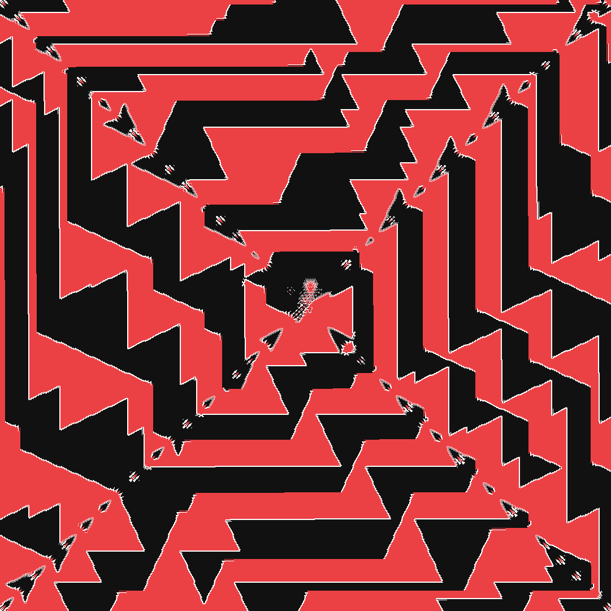
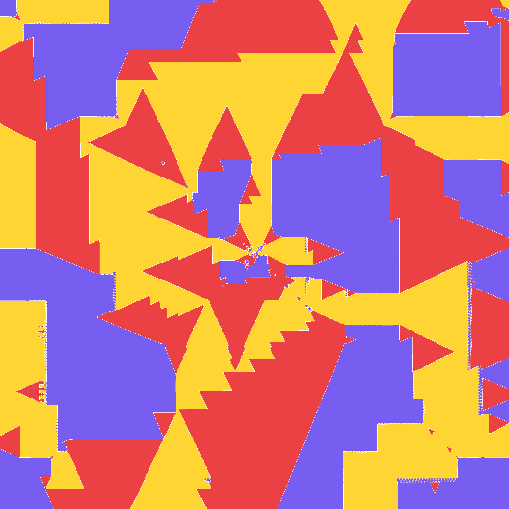
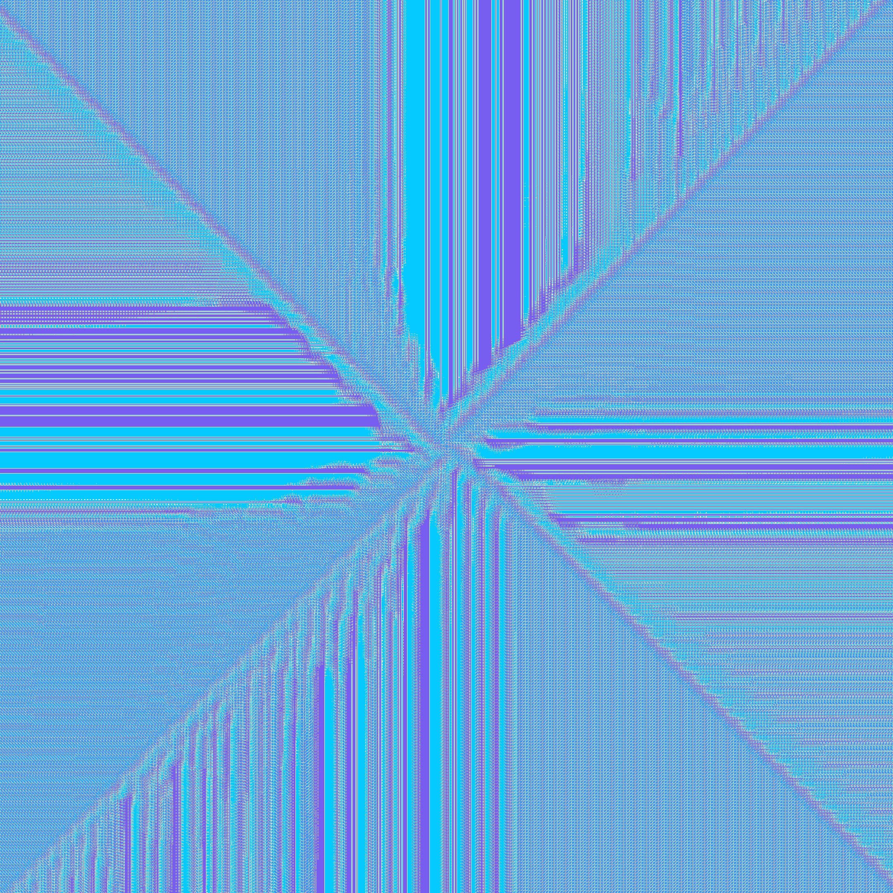

# `red-and-black`

A simulator for the types of games described in the numberphile video [Amazing Chessboard Patterns](https://www.youtube.com/watch?v=UiX4CFIiegM) and [Amazing Chessboard Patterns (extra)](https://www.youtube.com/watch?v=VgmDuBCayPw), meaning games of the form described in the following [OEIS](https://oeis.org/) sequences:
- [A308885](https://oeis.org/A308885/) for one knight
- [A392177](https://oeis.org/A392177/), [A392178](https://oeis.org/A392178/), and [A392179](https://oeis.org/A392179/) for two knights
- [A395645](https://oeis.org/A395645/), [A395646](https://oeis.org/A395646/), [A395647](https://oeis.org/A395647/), and [A395648](https://oeis.org/A395648/) for three knights.

The core is `simulator.js`, which is an adaptation of [the Python implementation on the OEIS for A392177](https://oeis.org/A392177/a392177_1.py.txt). Pardon my weird bespoke data structure in `bitGrid.js`, I got perhaps a bit too excited about optimization.

## Gallery

| | |
| --- | --- |
|  [**Black Knight, Red Knight**](https://yacavone.net/red-and-black/?players=1.2.b_1.2.r) (1081×1081) |  [**Black Knight, Red Antelope**](https://yacavone.net/red-and-black/?players=1.2.b_3.4.r) (1081×1081) |
|  [**Black Antelope, Red Giraffe, Yellow Flamingo**](https://yacavone.net/red-and-black/?players=3.4.b_1.4.r_1.6.y) (7561×7561) |  [**Red Knight, Yellow Antelope, Purple Commuter**](https://yacavone.net/red-and-black/?players=1.2.r_3.4.y_4.4.p) (4321×4321) |
|  [**Cyan Ferz, Purple Flamingo**](https://yacavone.net/red-and-black/?players=1.1.c_1.6.p) (2161×2161) | |

## AI Disclosure

The following elements of this project were generated by AI:
- The feature where you can hover/tap to see what a cell targets
- The user interface for customizing the players and the URL parameters
- Most of the optimizations made to rendering and `bitGrid.js`
- Most of the way the project is organized
- A decent ammount of the current comment documentation
- A few boilerplate functions
